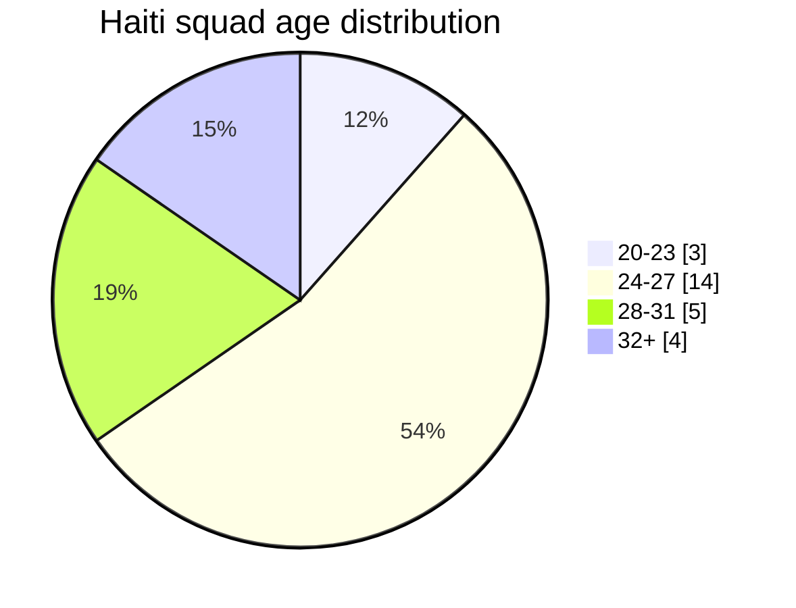

# Haiti World Cup Team Dossier

## Executive summary

Haiti arrive at the 2026 FIFA World Cup as one of the tournament’s most compelling over-achievers. They qualified for the finals for only the second time in their history, and for the first time since 1974, by topping Concacaf’s final-round Group C with a 3-2-1 record against Costa Rica, Honduras and Nicaragua. That achievement came despite the team being forced to play “home” qualifiers at neutral venues because of Haiti’s security crisis. FIFA’s World Cup draw placed them in Group C with Scotland, Brazil and Morocco.

The broad performance picture is that of a transition-first side with a small number of genuinely high-end individuals. Transfermarkt lists Haiti’s current squad at a total market value of about €55.8 million, with an average age of 27.6, and it pegs the side at FIFA world ranking No. 83 on its 2026 squad page. The value profile is highly concentrated: Wilson Isidor and Jean-Ricner Bellegarde alone account for roughly three-fifths of the squad’s headline market value, which is an inference from the listed player valuations.

On the pitch, Sébastien Migné’s Haiti are defined by intensity, tactical organisation and verticality. The Guardian’s pre-tournament team guide describes them as disciplined out of possession and dangerous in rapid transition, while also noting that Migné’s preferred shape has often been a 4-4-2 that can morph into a 4-2-3-1 defensively. Recent Transfermarkt match listings, meanwhile, show Haiti using a 4-2-3-1 against Tunisia and a 4-3-3 attacking shape against Iceland in March 2026. The dossier conclusion is that Haiti’s most plausible World Cup game-model is a flexible hybrid rather than a fixed template. 

The attacking spine is clear. Duckens Nazon is the historic reference point: Haiti’s current squad page records him on 81 caps and 44 international goals as of 2 June 2026. Frantzdy Pierrot is next on 49 caps and 34 goals, while World Cup qualifying output from Soccerway shows Nazon leading the campaign with six goals, Louicius Deedson adding four, and Danley Jean Jacques contributing two goals and three assists from midfield. Haiti’s upside rises further because Bellegarde and Isidor give them a level of athleticism and club pedigree that previous Haiti squads did not possess.

There are also clear limits. In the 2025 Gold Cup, Concacaf’s team page credits Haiti with just two goals in three matches, 44.5% possession on average, 76.07% passing accuracy, six yellow cards and one red card. Against Saudi Arabia in that tournament, they had 57% possession, 13 shots, 11 corners and 0.63 xG but still lost 0-1. That combination suggests a team capable of territorial pressure and transition volume, but not yet reliably clinical against organised blocks or elite opposition.

More broadly, Haiti’s qualification has carried social weight beyond football. Reporting from the Associated Press and the Guardian framed the team’s return to the World Cup as a rare source of national pride and unity amid political instability and violence. That context does not alter the tactical analysis, but it does help explain why this side has already outperformed external expectations.

## Squad overview

The table below combines Haiti’s current national-team squad listing, which states that caps and goals are correct as of 2 June 2026, with Transfermarkt’s 2026 Haiti squad pages for club affiliations. League labels reflect the best-verifiable 2025-26 club competition level from the accessible sources used here; where the accessible source trail was incomplete or potentially unstable, this is marked as “n/a” rather than guessed. Transfermarkt also notes that 25 of Haiti’s 26 current squad members are foreign-based, underlining how diaspora-driven this pool is.

| Player | Pos | Age | Caps | Goals | Club | League | Club country |
|---|---:|---:|---:|---:|---|---|---|
| Johny Placide | GK | 38 | 81 | 0 | Bastia | Ligue 2 | France |
| Alexandre Pierre | GK | 25 | 4 | 0 | Sochaux | Championnat National | France |
| Josué Duverger | GK | 26 | 1 | 0 | Cosmos Koblenz | n/a | Germany |
| Carlens Arcus | DF | 29 | 43 | 1 | Angers | Ligue 1 | France |
| Keeto Thermoncy | DF | 20 | 2 | 0 | Young Boys | n/a | Switzerland |
| Ricardo Adé | DF | 36 | 40 | 1 | LDU Quito | Ecuadorian Serie A | Ecuador |
| Hannes Delcroix | DF | 27 | 3 | 0 | Lugano | Swiss Super League | Switzerland |
| Martin Expérience | DF | 27 | 18 | 0 | Nancy | Ligue 2 | France |
| Duke Lacroix | DF | 32 | 24 | 2 | Colorado Springs Switchbacks | USL Championship | United States |
| Jean-Kévin Duverne | DF | 28 | 34 | 1 | Gent | Belgian Pro League | Belgium |
| Wilguens Paugain | DF | 24 | 3 | 0 | Zulte Waregem | Belgian Pro League | Belgium |
| Carl Sainté | MF | 23 | 8 | 0 | El Paso Locomotive | USL Championship | United States |
| Jean-Ricner Bellegarde | MF | 27 | 9 | 0 | Wolverhampton Wanderers | Championship | England |
| Léverton Pierre | MF | 28 | 30 | 1 | Vizela | Liga Portugal 2 | Portugal |
| Danley Jean Jacques | MF | 26 | 19 | 2 | Philadelphia Union | MLS | United States |
| Dominique Simon | MF | 25 | 1 | 0 | Tatran Prešov | n/a | Slovakia |
| Woodensky Pierre | MF | 21 | 7 | 0 | Violette AC | domestic league | Haiti |
| Derrick Etienne Jr. | FW | 29 | 23 | 1 | Toronto FC | MLS | Canada |
| Duckens Nazon | FW | 32 | 81 | 44 | Esteghlal | Persian Gulf Pro League | Iran |
| Louicius Deedson | FW | 25 | 16 | 10 | FC Dallas | MLS | United States |
| Ruben Providence | FW | 24 | 9 | 2 | Almere City | Eerste Divisie | Netherlands |
| Lenny Joseph | FW | 25 | 9 | 1 | Ferencváros | NB I | Hungary |
| Wilson Isidor | FW | 25 | 1 | 1 | Sunderland | n/a | England |
| Yassin Fortune | FW | 27 | 2 | 0 | Vizela | Liga Portugal 2 | Portugal |
| Frantzdy Pierrot | FW | 31 | 49 | 34 | Çaykur Rizespor | Süper Lig | Turkey |
| Josué Casimir | FW | 24 | 11 | 0 | Auxerre | Ligue 1 | France |

Haiti’s age profile is mature without being elderly. Fourteen of the 26 players in the current squad are between 24 and 27, only three are 23 or younger, and four are 32 or older. The veterans who matter most are not peripheral squad fillers either: Placide, Adé, Lacroix and Nazon all remain relevant pieces in either selection or leadership terms.

The age distribution below is calculated from the current squad ages listed on Haiti’s official squad section in Wikipedia and cross-checked against Transfermarkt’s average-age figure.



Transfermarkt’s value picture is sharply top-heavy. That matters analytically, because it tells you where the talent ceiling sits inside the squad: on transition forwards and central midfield ball-carriers rather than on the back line. 

| Player | Club | Pos | Transfermarkt value |
|---|---|---|---:|
| Wilson Isidor | Sunderland | FW | €18.0m |
| Jean-Ricner Bellegarde | Wolverhampton Wanderers | MF | €16.0m |
| Danley Jean Jacques | Philadelphia Union | MF | €3.0m |
| Josué Casimir | Auxerre | FW | €3.0m |
| Jean-Kévin Duverne | Gent | DF | €2.0m |
| Hannes Delcroix | Lugano | DF | €2.0m |
| Lenny Joseph | Ferencváros | FW | €2.0m |
| Carlens Arcus | Angers | DF | €1.8m |
| Frantzdy Pierrot | Çaykur Rizespor | FW | €1.5m |
| Louicius Deedson | FC Dallas | FW | €1.2m |
| Ricardo Adé | LDU Quito | DF | €1.0m |
| Keeto Thermoncy | Young Boys | DF | €0.8m |

*Transfermarkt’s squad page lists Haiti’s total market value at about €55.8m and its average age at 27.6. Values above are the leading individual figures visible from the current 2026 squad page.* 

## Tactical projection

Haiti’s tactical identity under Migné is better understood as a theme than as a fixed chalkboard. FIFA’s interviews with the coach stress ambition, tactical “nous” and a real belief that Haiti can trouble stronger sides, while the Guardian’s tournament guide describes a disciplined, intense team built for rapid transitions. That same guide says Migné’s 4-4-2 often uses attacking full-backs for width and crossing, and can shift to a 4-2-3-1 when Haiti defend. Transfermarkt’s match listings add evidence that he has also used 4-2-3-1 and 4-3-3 variants in the March 2026 friendlies.

The most reliable selector clues come from three places. First, the official Concacaf Gold Cup line-up against Saudi Arabia included Placide, Arcus, Adé, Expérience, Duverne, Danley Jean Jacques, Christopher Attys, Léverton Pierre, Deedson, Nazon and Pierrot. Second, Soccerway’s qualifying statistics show the heaviest minute totals in the World Cup campaign for Adé, Pierrot, Danley, Arcus, Placide, Duke Lacroix, Duverne and Nazon. Third, the March 2026 friendlies added newer high-upside names such as Bellegarde, Delcroix and Isidor into the pre-World Cup equation.

My best analytical projection is therefore a 4-2-3-1 that can flatten into 4-4-2 without the ball:

```text
                         Placide

            Arcus      Adé      Delcroix      Duverne

                  Danley Jean Jacques   Bellegarde

               Deedson        Nazon        Providence

                         Pierrot
```

The rationale is straightforward. Placide remains the senior reference in goal. Arcus and Duverne fit Migné’s width-and-crossing logic, while Adé is still the central organiser. Delcroix offers a more mobile centre-back profile next to Adé than some alternatives. Danley is Haiti’s clearest two-way midfielder on qualifying output, and Bellegarde brings the highest technical floor and strongest club pedigree in the pool. Nazon is too important not to centralise, but his best use in a World Cup context may be as a roaming second-line creator behind a fixed striker rather than as a pure penalty-box nine. Providence and Deedson bring pace and directness; Pierrot offers the most obvious target for early crosses and set-piece deliveries.

There is a serious alternative: a more aggressive 4-3-3 with Isidor replacing either Providence or Pierrot. That version makes sense if Migné prioritises pure running power in transition or wants an outlet who can attack the space behind a high line. Isidor’s equaliser against Iceland on 31 March 2026, combined with his squad-leading €18.0m market value, is enough to treat him as a live starting threat rather than a luxury bench option.

Recommended alternatives and dead-ball assignments are necessarily analytical rather than official, because final pre-match FIFA team sheets will decide the actual starters. Even so, the patterns below fit the published data.

| Situation | Preferred change | Analytical rationale |
|---|---|---|
| Need more pace in transition | Isidor for Pierrot, Nazon moves higher | Maximises vertical running and space attacking |
| Need more central control | Léverton Pierre for a winger | Adds passing volume and midfield retention |
| Need more defensive security | Expérience or Lacroix into the back line | More conservative profile; Duverne can slide wide |
| Need late penalty-box presence | Lenny Joseph as second striker | Extra aerial and box occupation threat |

| Set piece | Recommended taker | Why |
|---|---|---|
| Penalties | Nazon first, Pierrot second | Nazon is the primary scorer; Pierrot is the next proven finisher |
| Direct free-kicks | Nazon, then Bellegarde | Nazon’s shot volume and central status; Bellegarde for cleaner strike profile |
| Right-sided corners | Bellegarde or Casimir | Best fit for controlled inswing/outswing delivery profiles |
| Left-sided corners | Providence or Léverton Pierre | Best fit for wide service and second-ball creation |

## Key player profiles

### Duckens Nazon

Nazon is the symbolic and statistical centre of the project. Haiti’s current squad listing puts him on 81 caps and 44 international goals, tying him among the nation’s current appearance leaders and making him the all-time scoring reference in the active pool. In World Cup qualifying he produced six goals and one assist in 10 matches and 599 minutes, which made him Haiti’s most productive attacker in the campaign. Transfermarkt values him at €800k, a modest club-market number that understates his national-team importance.

Biographically, he is a France-born forward who has become the emotional emblem of modern Haiti. His strengths are clear in the data: finishing volume, leadership, and the ability to produce decisive moments in qualification, as illustrated most dramatically by his hat-trick in the 3-3 draw away to Costa Rica on 9 September 2025. The main analytical weakness is not a flaw so much as a dependency risk: Haiti’s chance-to-goal conversion still leans too heavily toward him when games become stretched or chaotic.

### Jean-Ricner Bellegarde

Bellegarde is the squad’s highest-level midfielder by club environment and one of its most important late-cycle upgrades. Wikipedia’s current player profile lists him as born in Colombes, France, and now attached to Wolverhampton Wanderers, while Haiti’s squad page records him on nine caps. Transfermarkt gives him a €16.0m value, second only to Isidor in the current squad. In the World Cup qualifying sample published by Soccerway, he logged 526 minutes in six appearances with one assist.

His strengths are composure, carrying ability and connective play. The Guardian explicitly describes him as Haiti’s midfield engine, and that matches the statistical profile: meaningful minutes, some creative output, and the technical security to raise Haiti’s level against stronger opponents. The analytical question is not whether he is good enough, but how much attacking burden should sit on him. He is more engine-room controller than final-third volume creator for Haiti so far.

### Danley Jean Jacques

Jean Jacques is the most complete all-round midfielder in the campaign data. His player profile identifies him as a Haiti-born midfielder from Petit-Goâve who now plays for Philadelphia Union after previously developing through Don Bosco and Metz. In the qualifying stats sample, he posted nine appearances, 756 minutes, two goals and three assists, which is arguably the most well-rounded line in the entire squad. Transfermarkt values him at €3.0m.

The Guardian’s description of him as an “indispensable engine” that breaks up attacks and dictates tempo is borne out by the numbers and by role logic. He is Haiti’s best blend of running power, ballast and secondary contribution. The main weakness is disciplinary risk: in the 0-1 friendly loss to Tunisia on 28 March 2026 he was booked and then dismissed late on a second yellow, which is a reminder that his aggression can spill over under pressure.

### Frantzdy Pierrot

Pierrot remains Haiti’s most reliable orthodox striker profile. His player page identifies him as a 1.94m forward born in Cap-Haïtien who has moved through US college football, Belgium, France, Israel, Greece and now Turkish football with Çaykur Rizespor. Haiti’s current squad page credits him with 49 caps and 34 goals, and Soccerway’s qualifying table gives him 10 appearances, 754 minutes, two goals and one assist. He also scored the winner in Haiti’s pivotal 1-0 defeat of Costa Rica on 13 November 2025 and found the net again in the 4-0 warm-up win over New Zealand on 2 June 2026.

His strengths are obvious: aerial reach, hold-up value, penalty-box occupation and set-piece utility. The tactical compromise is mobility. Against top-class back lines, Haiti may at times prefer Isidor’s running or Nazon’s movement between the lines. That does not reduce Pierrot’s importance; it simply means Migné may vary his centre-forward depending on game state and opponent. Transfermarkt values him at €1.5m.

### Wilson Isidor

Isidor is the ceiling-raiser. His player profile identifies him as a France-born striker developed at Rennes and Monaco before moving through Laval, Bastia-Borgo, Lokomotiv Moscow, Zenit and Sunderland. He is still a newcomer internationally, but he already has one cap and one goal for Haiti, the latter being the late equaliser against Iceland in Toronto on 31 March 2026. Transfermarkt values him at €18.0m, the highest figure in the squad.

The attraction is simple: pace, movement and counter-attacking fit. The Guardian explicitly called him Haiti’s main attacking threat because of his pace, movement and technical ability, and that aligns with the broader tactical evidence around a transition-led side. The uncertainty is integration rather than quality. Because his Haiti sample is still small, Migné must decide whether the World Cup is the moment to build around him immediately or unleash him selectively.

### Sébastien Migné

Migné is a French coach who took charge of Haiti in 2024 and then oversaw the entire successful World Cup qualification campaign. FIFA’s interviews and profile pieces present him as a coach of real conviction who believes Haiti can do more than simply participate, while the Guardian notes that he previously worked with Claude Le Roy and managed African national teams including Congo and Kenya. The Guardian also reported that, because of Haiti’s security situation, he has never set foot in the country during his tenure.

Tactically, his calling card is a compact, vertical side that defends with discipline and tries to spring forward quickly. The important nuance is that he has already shown enough flexibility to adapt the front structure around Nazon, Pierrot, Isidor and the wide runners. Haiti do not look like a possession-first team under him; they look like a team that know exactly where the danger should come from.

## Form and statistical summary

Publicly accessible FHF coverage confirms that Haiti were already in active World Cup qualifying mode in June 2024, including the 2-1 win over Saint Lucia. The federation’s public senior-men’s update stream is available, but the accessible coverage becomes patchier thereafter, so the detailed results table below focuses on the best-verified June 2025 to June 2026 period, where FIFA, Wikipedia, Concacaf and Soccerway align more consistently.

| Date | Competition | Opponent | Result | Haiti scorers |
|---|---|---|---|---|
| 7 Jun 2025 | World Cup qualifying | Aruba | W 5-0 | Jean Jacques, Pierrot, Providence, Nazon, Prunier |
| 10 Jun 2025 | World Cup qualifying | Curaçao | L 1-5 | Louicius |
| 15 Jun 2025 | Gold Cup | Saudi Arabia | L 0-1 | — |
| 19 Jun 2025 | Gold Cup | Trinidad and Tobago | D 1-1 | Pierrot |
| 22 Jun 2025 | Gold Cup | United States | L 1-2 | Louicius |
| 5 Sep 2025 | World Cup qualifying | Honduras | D 0-0 | — |
| 9 Sep 2025 | World Cup qualifying | Costa Rica | D 3-3 | Nazon 3 |
| 9 Oct 2025 | World Cup qualifying | Nicaragua | W 3-0 | Nazon, Jean Jacques, Louicius |
| 13 Oct 2025 | World Cup qualifying | Honduras | L 0-3 | — |
| 13 Nov 2025 | World Cup qualifying | Costa Rica | W 1-0 | Pierrot |
| 18 Nov 2025 | World Cup qualifying | Nicaragua | W 2-0 | Louicius, Providence |
| 28 Mar 2026 | Friendly | Tunisia | L 0-1 | — |
| 31 Mar 2026 | Friendly | Iceland | D 1-1 | Isidor |
| 2 Jun 2026 | Friendly | New Zealand | W 4-0 | Providence, Joseph, Pierrot, Lacroix |

*This recent-match table is compiled from the national-team results chronology on Wikipedia plus Soccerway/FIFA-linked match reports attached there.* 

Across that best-verified 14-match run, Haiti went 5-4-5 with 22 goals scored and 17 conceded. The trendline is instructive rather than smooth: a poor June 2025 reset after the heavy Curaçao defeat, a disappointing Gold Cup, a strong autumn qualification surge, then a March wobble followed by the emphatic 4-0 win over New Zealand. 

The flow below visualises the most meaningful steps in that recent arc. 

```mermaid
flowchart LR
    A["7 Jun 2025<br/>Aruba 0-5 Haiti"] --> B["10 Jun 2025<br/>Haiti 1-5 Curaçao"]
    B --> C["22 Jun 2025<br/>USA 2-1 Haiti"]
    C --> D["9 Sep 2025<br/>Costa Rica 3-3 Haiti"]
    D --> E["9 Oct 2025<br/>Nicaragua 0-3 Haiti"]
    E --> F["13 Oct 2025<br/>Honduras 3-0 Haiti"]
    F --> G["13 Nov 2025<br/>Haiti 1-0 Costa Rica"]
    G --> H["18 Nov 2025<br/>Haiti 2-0 Nicaragua"]
    H --> I["31 Mar 2026<br/>Haiti 1-1 Iceland"]
    I --> J["2 Jun 2026<br/>Haiti 4-0 New Zealand"]
```



Because official all-competition player passing and defensive aggregates are not consistently published in accessible formats for Haiti, the statistical summary below uses three layers: World Cup qualifying player output from Soccerway, official Gold Cup team statistics from Concacaf, and an official detailed Gold Cup match report sample against Saudi Arabia. Where data were not published in an accessible source, the entry is marked “n/a”.

| Team sample | Matches | Record | Goals | Possession | Passing accuracy | Shots | xG | Tackles won | Duels won | Cards |
|---|---:|---|---:|---:|---:|---:|---:|---:|---:|---|
| 2025 Gold Cup group stage | 3 | 0-1-2 | 2 | 44.5% | 76.07% | 53 | n/a | 35 | 155 | 6Y, 1R |
| v Saudi Arabia, 15 Jun 2025 | 1 | 0-1 | 0 | 57.0% | 74.3% | 13 | 0.63 | n/a | n/a | 4Y, 0R |
| 2025 World Cup final round | 6 | 3-2-1 | 9 | n/a | n/a | n/a | n/a | n/a | n/a | n/a |

*Gold Cup team statistics are from Concacaf’s official team page; the Saudi Arabia row is from the official Concacaf post-match report; the final-round qualification line is derived directly from the verified match results above.*

| Player | Apps | Minutes | Goals | Assists | Yellow | Red |
|---|---:|---:|---:|---:|---:|---:|
| Duckens Nazon | 10 | 599 | 6 | 1 | 1 | 0 |
| Louicius Deedson | 10 | 429 | 4 | 0 | 0 | 0 |
| Danley Jean Jacques | 9 | 756 | 2 | 3 | 2 | 0 |
| Frantzdy Pierrot | 10 | 754 | 2 | 1 | 0 | 0 |
| Ruben Providence | 7 | 415 | 2 | 1 | 0 | 0 |
| Jean-Kévin Duverne | 7 | 630 | 1 | 0 | 0 | 0 |
| Duke Lacroix | 8 | 720 | 1 | 2 | 0 | 0 |
| Josué Casimir | 4 | 322 | 0 | 1 | 1 | 0 |
| Jean-Ricner Bellegarde | 6 | 526 | 0 | 1 | 1 | 0 |
| Carlens Arcus | 9 | 751 | 0 | 1 | 3 | 0 |
| Léverton Pierre | 9 | 596 | 0 | 0 | 1 | 0 |
| Ricardo Adé | 10 | 899 | 0 | 0 | 0 | 0 |

*These are Haiti’s World Cup qualifying “World Championship” player outputs on Soccerway, which provide the best accessible campaign-level line for goals, assists and minutes.*

The official Concacaf Saudi Arabia post-match report also gives a useful single-match passing and duel sample for scouting. It shows Jean-Kévin Duverne as Haiti’s successful-pass leader on 33, with Ricardo Adé and Danley Jean Jacques on 28 each, Carlens Arcus on 27 and Léverton Pierre on 25. The same report notes that Léverton Pierre and Christopher Attys both won more than 10 duels in the match, a sign that Haiti can physically compete even when the chance conversion falls short.

## Historical context

Haiti are one of the historically significant Caribbean men’s national teams. Their current team page records two World Cup appearances, in 1974 and 2026, and notes that they are the only Caribbean side to have won the old CONCACAF Championship, which they did in 1973. The same source says their best Gold Cup-era performance was a semi-final run in 2019. Wikipedia’s World Cup history page adds that Haiti’s only previous finals campaign ended in three group-stage defeats, with a 2-14 goal difference overall. 

The 1974 team still owns Haiti’s most famous World Cup moment. Emmanuel Sanon scored in the 1-3 defeat to Italy and again in the 1-4 loss to Argentina; the World Cup history page notes that both Haitian goals at the finals were Sanon’s, and that the strike against Italy ended Dino Zoff’s long run without conceding internationally. That remains the emotional benchmark for this generation to chase.

Regionally, Haiti’s pedigree is stronger than casual observers may realise. Their main team page says they have appeared 17 times in Concacaf’s premier continental tournament, won the title in 1973, and also claimed regional honours in the CFU/Caribbean Cup ecosystem. Under the modern Gold Cup format, however, their most relevant contemporary marker is the 2019 semi-final, where they reached their deepest run before losing narrowly to Mexico.

The squad data also underline continuity with older generations. Haiti’s records section identifies Pierre Richard Bruny as the all-time caps leader on 95, while active players Johny Placide and Duckens Nazon both sit on 81 caps. Nazon’s 44 goals make him the live reference in national-team scoring. At the same time, the same records section warns that FHF archives were disrupted by earthquakes and civil unrest, so some early player data remain under investigation. That caveat matters when working with long-range Haitian football history.

## Risks, opportunities and source notes

Haiti’s principal tactical threats are easy to identify. They have a proven scorer in Nazon, a classic target in Pierrot, a more explosive transition option in Isidor, and direct wide runners in Providence and Deedson. Migné’s system also pushes full-backs forward, which suits Arcus and Duverne and allows Haiti to create crossing volume quickly. Danley Jean Jacques and Bellegarde, meanwhile, give them enough central athleticism to turn loose balls into counters rather than simply clearing danger.

The main opportunities for opponents lie in forcing Haiti to build longer possessions than they want. Official Gold Cup data show a side that could still produce only two goals in three matches, while the Saudi Arabia report shows a match in which Haiti generated 57% possession, 13 shots, 11 corners and four shots on target yet still failed to score. That pattern suggests they are more dangerous when the game is open and transitional than when they must patiently dismantle a set defence.

A second vulnerability is game-state management against stronger or more physical opponents. Haiti’s verified recent slate includes a 5-1 defeat to Curaçao and a 3-0 defeat in Honduras, both of which show how badly the structure can distort when the opposition starts winning midfield territory and first contacts. By contrast, Haiti’s best work in the same cycle came when they could protect a narrow lead or attack a stretched game, as in the victories over Costa Rica, Nicaragua and New Zealand.

The current availability picture is relatively clean in the accessible official sources, but it comes with caution. FIFA’s final 26-man squad announcement did not publicly flag injury withdrawals in the snippet available here, and no current World Cup suspensions were visible in the official squad pages consulted. The one recent disciplinary note worth carrying is Danley Jean Jacques’s late dismissal in the Tunisia friendly on 28 March 2026, which is relevant for temperament but does not itself imply a World Cup suspension.

For source quality, the most dependable layers for this dossier were FIFA for tournament context, official squad-announcement framing and coach interviews; Concacaf for qualification summaries and Gold Cup match data; the FHF site for federation context and the limited accessible senior-men’s update stream; Transfermarkt for market values and club affiliations; Soccerway for qualifying player-output tables; and Wikipedia for the current squad’s caps/goals date stamp, the verified recent results chronology, and historical record tables. That mix gives a robust dossier, but some gaps remain, especially around all-competition player passing and defensive aggregates and around a few lower-tier league labels. Those are explicitly marked where necessary rather than guessed.
